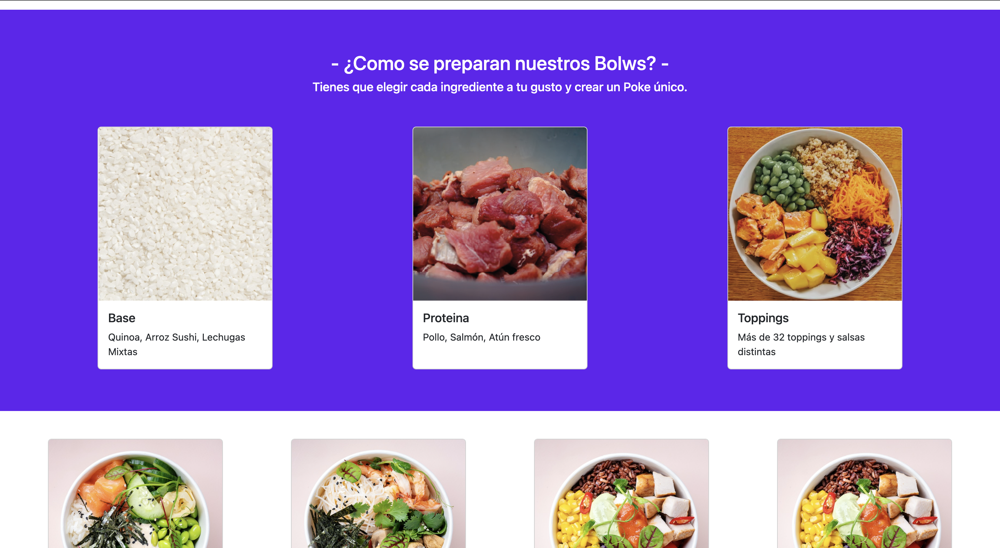
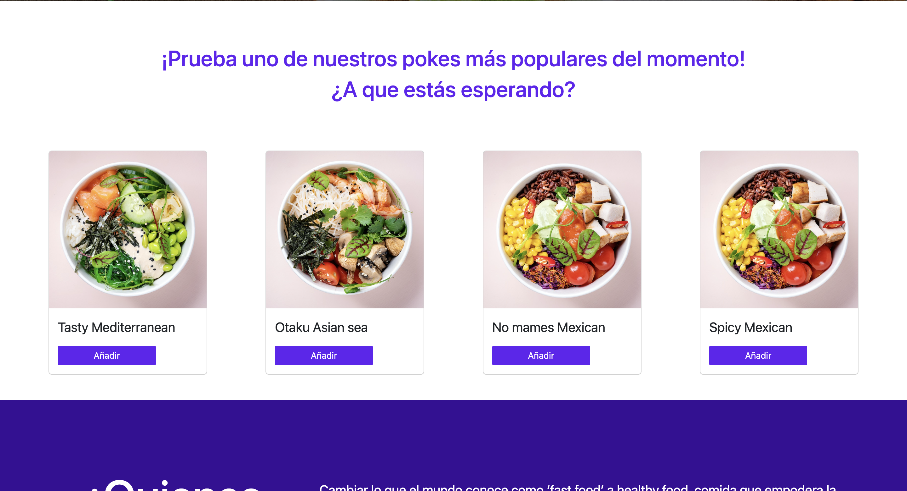

# Carta Restaurante Digital

  
Contenido 

  <ol>
    <li><a href="#objetivo-🎯">Objetivo</a></li>
    <li><a href="#vistas">Vistas</a></li>
    <li><a href="#deploy">Deploy Consola</a></li>
    <li><a href="#stack">Stack</a></li>
    <li><a href="#futuras-funcionalidades">Futuras funcionalidades</a></li>
    <li><a href="#contacto">Contacto</a></li>
  </ol>

## Objetivo 🎯

Requeriamos de la reproducción de una carta de un restaurante a elección en y recrearla con la ayuda de HTML, CSS y Bootstrap.

## Vistas

Pagina principal 

Carta  

Productos destacados 

## Deploy Restaurante

<a href="https://stevengs7.github.io/Restaurante/" target="_blank"/>Ir a la pagina web del restaurante</a>

## Stack

    
    
    
    
 

## Futuras funcionalidades

✅ Añadir un un contador al numero de pokes que queramos comprar. 
⬜ Tienda online con carrito en el cual podamos introducir nuestros datos para la compra 
⬜ Añadir suscripcion de newsletter en el apartado de la Ubicación 

## Contacto

